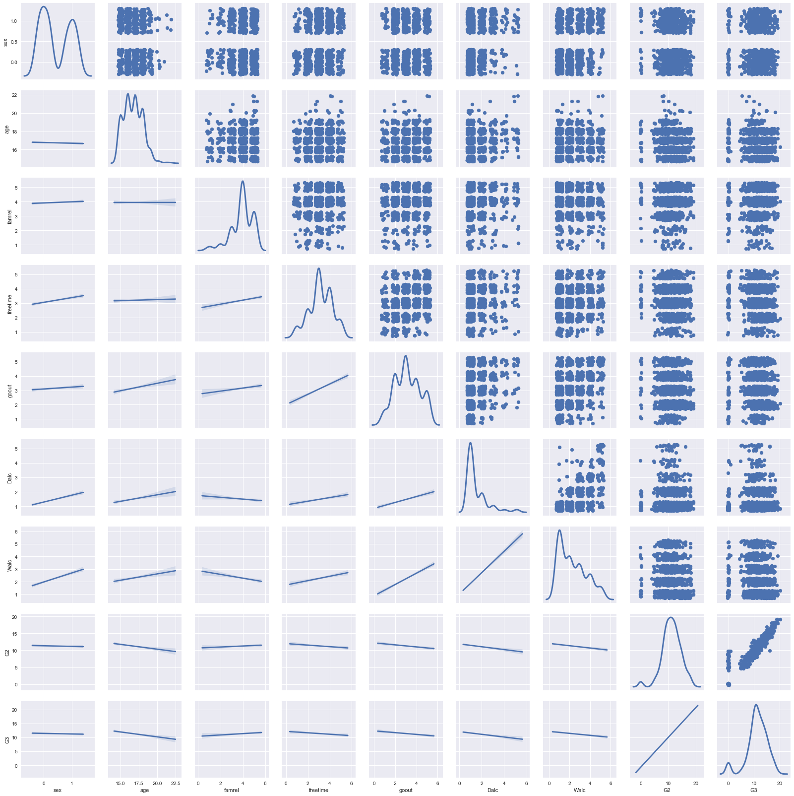
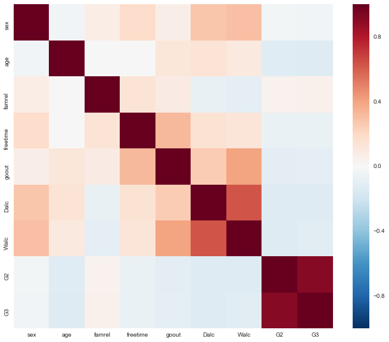
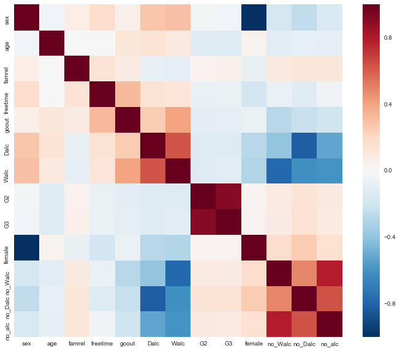

# Preparing a Data Set to Model

Using a dataset of your choice, select an outcome variable and then pick four or five other variables (one to two categorical, three to four continuous) to act as the basis for features. Explore the variables using the univariate and bivariate methods you've learned so far.

Next, based on what you learned via your data exploration, create ten new features. Explain the reasoning behind each one.

Finally, use filtering methods to select the five best features and justify your choices.

## Data Set: Student Alcohol Data

Will focus on the variables below:

2 sex - student's sex (binary: 'F' - female or 'M' - male)  
3 age - student's age (numeric: from 15 to 22)  
24 famrel - quality of family relationships (numeric: from 1 - very bad to 5 - excellent)  
25 freetime - free time after school (numeric: from 1 - very low to 5 - very high)  
26 goout - going out with friends (numeric: from 1 - very low to 5 - very high)  
27 Dalc - workday alcohol consumption (numeric: from 1 - very low to 5 - very high)  
28 Walc - weekend alcohol consumption (numeric: from 1 - very low to 5 - very high)  
31 G2 - second period grade (numeric: from 0 to 20)  

To try and predict this variable:  
32 G3 - final grade (numeric: from 0 to 20, output target)  


```python
%matplotlib inline
import numpy as np
import pandas as pd
import seaborn as sns
from matplotlib import pyplot as plt
from scipy import stats

file_math = ('C:\\Users\\Abe\\Data Science Bootcamp\\Student Alcohol Data\\student-mat.csv')
file_por = ('C:\\Users\\Abe\\Data Science Bootcamp\\Student Alcohol Data\\student-por.csv')
df_math = pd.read_csv(file_math, sep=';')
df_por = pd.read_csv(file_por, sep=';')

df = df_math.append(df_por)
```


```python
df_ss = df[['sex','age','famrel','freetime','goout','Dalc','Walc','G2','G3']]
df_ss['sex'].replace(['F','M'],[0,1], inplace=True)

jitter = pd.DataFrame(np.random.uniform(low=-.3,high=.3,size=df_ss.shape), columns=df_ss.columns)
df_jittered = df_ss.add(jitter)
```

    c:\users\abe\appdata\local\programs\python\python36-32\lib\site-packages\pandas\core\generic.py:3554: SettingWithCopyWarning: 
    A value is trying to be set on a copy of a slice from a DataFrame
    
    See the caveats in the documentation: http://pandas.pydata.org/pandas-docs/stable/indexing.html#indexing-view-versus-copy
      self._update_inplace(new_data)
    


```python
plot = sns.PairGrid(df_jittered.dropna(), diag_sharey=False)
plot.map_upper(plt.scatter)
plot.map_lower(sns.regplot, scatter_kws=dict(alpha=0))
plot.map_diag(sns.kdeplot, lw=3)
plt.show()
```

    c:\users\abe\appdata\local\programs\python\python36-32\lib\site-packages\matplotlib\axes\_axes.py:545: UserWarning: No labelled objects found. Use label='...' kwarg on individual plots.
      warnings.warn("No labelled objects found. "
    





```python
corrmat = df_ss.corr()
corrmat
```


<div>
<table border="1" class="dataframe">
  <thead>
    <tr style="text-align: right;">
      <th></th>
      <th>sex</th>
      <th>age</th>
      <th>famrel</th>
      <th>freetime</th>
      <th>goout</th>
      <th>Dalc</th>
      <th>Walc</th>
      <th>G2</th>
      <th>G3</th>
    </tr>
  </thead>
  <tbody>
    <tr>
      <th>sex</th>
      <td>1.000000</td>
      <td>-0.038832</td>
      <td>0.074725</td>
      <td>0.181603</td>
      <td>0.062530</td>
      <td>0.275928</td>
      <td>0.302623</td>
      <td>-0.025024</td>
      <td>-0.031472</td>
    </tr>
    <tr>
      <th>age</th>
      <td>-0.038832</td>
      <td>1.000000</td>
      <td>0.007162</td>
      <td>0.002645</td>
      <td>0.118510</td>
      <td>0.133453</td>
      <td>0.098291</td>
      <td>-0.119475</td>
      <td>-0.125282</td>
    </tr>
    <tr>
      <th>famrel</th>
      <td>0.074725</td>
      <td>0.007162</td>
      <td>1.000000</td>
      <td>0.136901</td>
      <td>0.080619</td>
      <td>-0.076483</td>
      <td>-0.100663</td>
      <td>0.042054</td>
      <td>0.054461</td>
    </tr>
    <tr>
      <th>freetime</th>
      <td>0.181603</td>
      <td>0.002645</td>
      <td>0.136901</td>
      <td>1.000000</td>
      <td>0.323556</td>
      <td>0.144979</td>
      <td>0.130377</td>
      <td>-0.068952</td>
      <td>-0.064890</td>
    </tr>
    <tr>
      <th>goout</th>
      <td>0.062530</td>
      <td>0.118510</td>
      <td>0.080619</td>
      <td>0.323556</td>
      <td>1.000000</td>
      <td>0.253135</td>
      <td>0.399794</td>
      <td>-0.108411</td>
      <td>-0.097877</td>
    </tr>
    <tr>
      <th>Dalc</th>
      <td>0.275928</td>
      <td>0.133453</td>
      <td>-0.076483</td>
      <td>0.144979</td>
      <td>0.253135</td>
      <td>1.000000</td>
      <td>0.627814</td>
      <td>-0.131576</td>
      <td>-0.129642</td>
    </tr>
    <tr>
      <th>Walc</th>
      <td>0.302623</td>
      <td>0.098291</td>
      <td>-0.100663</td>
      <td>0.130377</td>
      <td>0.399794</td>
      <td>0.627814</td>
      <td>1.000000</td>
      <td>-0.128114</td>
      <td>-0.115740</td>
    </tr>
    <tr>
      <th>G2</th>
      <td>-0.025024</td>
      <td>-0.119475</td>
      <td>0.042054</td>
      <td>-0.068952</td>
      <td>-0.108411</td>
      <td>-0.131576</td>
      <td>-0.128114</td>
      <td>1.000000</td>
      <td>0.910743</td>
    </tr>
    <tr>
      <th>G3</th>
      <td>-0.031472</td>
      <td>-0.125282</td>
      <td>0.054461</td>
      <td>-0.064890</td>
      <td>-0.097877</td>
      <td>-0.129642</td>
      <td>-0.115740</td>
      <td>0.910743</td>
      <td>1.000000</td>
    </tr>
  </tbody>
</table>
</div>


```python
plt.figure(figsize=(12,10))
sns.heatmap(corrmat)
plt.show()
```





# Insights

Looking at the charts above, G2 has the strongest correlation with G3. It looks like no other variables have a strong correlation either way.  

# Feature Engineering

Features created:

- Male Gender
- Female Gender
- No Workday drinking (Dalc = 1)
- No Weekend drinking (Walc = 1)
- No Drinking (Dalc & Walc = 1)
- High School Age = (Age = 15-18)


```python
df_ss['female'] = np.where(df_ss['sex'] == 0, 1, 0)
df_ss['no_Walc'] = np.where(df_ss['Walc'] == 1, 1, 0)
df_ss['no_Dalc'] = np.where(df_ss['Dalc'] == 1, 1, 0)
df_ss['no_alc'] = np.where((df_ss['Dalc'] == 1 & df_ss['Walc']) == 1, 1, 0)

corrmat = df_ss.corr()

plt.figure(figsize=(12,10))
sns.heatmap(corrmat)
plt.show()
corrmat
```

    c:\users\abe\appdata\local\programs\python\python36-32\lib\site-packages\ipykernel\__main__.py:1: SettingWithCopyWarning: 
    A value is trying to be set on a copy of a slice from a DataFrame.
    Try using .loc[row_indexer,col_indexer] = value instead
    
    See the caveats in the documentation: http://pandas.pydata.org/pandas-docs/stable/indexing.html#indexing-view-versus-copy
      if __name__ == '__main__':
    c:\users\abe\appdata\local\programs\python\python36-32\lib\site-packages\ipykernel\__main__.py:2: SettingWithCopyWarning: 
    A value is trying to be set on a copy of a slice from a DataFrame.
    Try using .loc[row_indexer,col_indexer] = value instead
    
    See the caveats in the documentation: http://pandas.pydata.org/pandas-docs/stable/indexing.html#indexing-view-versus-copy
      from ipykernel import kernelapp as app
    c:\users\abe\appdata\local\programs\python\python36-32\lib\site-packages\ipykernel\__main__.py:3: SettingWithCopyWarning: 
    A value is trying to be set on a copy of a slice from a DataFrame.
    Try using .loc[row_indexer,col_indexer] = value instead
    
    See the caveats in the documentation: http://pandas.pydata.org/pandas-docs/stable/indexing.html#indexing-view-versus-copy
      app.launch_new_instance()
    c:\users\abe\appdata\local\programs\python\python36-32\lib\site-packages\ipykernel\__main__.py:4: SettingWithCopyWarning: 
    A value is trying to be set on a copy of a slice from a DataFrame.
    Try using .loc[row_indexer,col_indexer] = value instead
    
    See the caveats in the documentation: http://pandas.pydata.org/pandas-docs/stable/indexing.html#indexing-view-versus-copy
    





<div>
<table border="1" class="dataframe">
  <thead>
    <tr style="text-align: right;">
      <th></th>
      <th>sex</th>
      <th>age</th>
      <th>famrel</th>
      <th>freetime</th>
      <th>goout</th>
      <th>Dalc</th>
      <th>Walc</th>
      <th>G2</th>
      <th>G3</th>
      <th>female</th>
      <th>no_Walc</th>
      <th>no_Dalc</th>
      <th>no_alc</th>
    </tr>
  </thead>
  <tbody>
    <tr>
      <th>sex</th>
      <td>1.000000</td>
      <td>-0.038832</td>
      <td>0.074725</td>
      <td>0.181603</td>
      <td>0.062530</td>
      <td>0.275928</td>
      <td>0.302623</td>
      <td>-0.025024</td>
      <td>-0.031472</td>
      <td>-1.000000</td>
      <td>-0.177854</td>
      <td>-0.254077</td>
      <td>-0.156842</td>
    </tr>
    <tr>
      <th>age</th>
      <td>-0.038832</td>
      <td>1.000000</td>
      <td>0.007162</td>
      <td>0.002645</td>
      <td>0.118510</td>
      <td>0.133453</td>
      <td>0.098291</td>
      <td>-0.119475</td>
      <td>-0.125282</td>
      <td>0.038832</td>
      <td>-0.111338</td>
      <td>-0.078727</td>
      <td>-0.091832</td>
    </tr>
    <tr>
      <th>famrel</th>
      <td>0.074725</td>
      <td>0.007162</td>
      <td>1.000000</td>
      <td>0.136901</td>
      <td>0.080619</td>
      <td>-0.076483</td>
      <td>-0.100663</td>
      <td>0.042054</td>
      <td>0.054461</td>
      <td>-0.074725</td>
      <td>0.096271</td>
      <td>0.122034</td>
      <td>0.122178</td>
    </tr>
    <tr>
      <th>freetime</th>
      <td>0.181603</td>
      <td>0.002645</td>
      <td>0.136901</td>
      <td>1.000000</td>
      <td>0.323556</td>
      <td>0.144979</td>
      <td>0.130377</td>
      <td>-0.068952</td>
      <td>-0.064890</td>
      <td>-0.181603</td>
      <td>-0.065146</td>
      <td>-0.135843</td>
      <td>-0.044209</td>
    </tr>
    <tr>
      <th>goout</th>
      <td>0.062530</td>
      <td>0.118510</td>
      <td>0.080619</td>
      <td>0.323556</td>
      <td>1.000000</td>
      <td>0.253135</td>
      <td>0.399794</td>
      <td>-0.108411</td>
      <td>-0.097877</td>
      <td>-0.062530</td>
      <td>-0.274145</td>
      <td>-0.226939</td>
      <td>-0.197982</td>
    </tr>
    <tr>
      <th>Dalc</th>
      <td>0.275928</td>
      <td>0.133453</td>
      <td>-0.076483</td>
      <td>0.144979</td>
      <td>0.253135</td>
      <td>1.000000</td>
      <td>0.627814</td>
      <td>-0.131576</td>
      <td>-0.129642</td>
      <td>-0.275928</td>
      <td>-0.397586</td>
      <td>-0.821365</td>
      <td>-0.525996</td>
    </tr>
    <tr>
      <th>Walc</th>
      <td>0.302623</td>
      <td>0.098291</td>
      <td>-0.100663</td>
      <td>0.130377</td>
      <td>0.399794</td>
      <td>0.627814</td>
      <td>1.000000</td>
      <td>-0.128114</td>
      <td>-0.115740</td>
      <td>-0.302623</td>
      <td>-0.784916</td>
      <td>-0.614334</td>
      <td>-0.599754</td>
    </tr>
    <tr>
      <th>G2</th>
      <td>-0.025024</td>
      <td>-0.119475</td>
      <td>0.042054</td>
      <td>-0.068952</td>
      <td>-0.108411</td>
      <td>-0.131576</td>
      <td>-0.128114</td>
      <td>1.000000</td>
      <td>0.910743</td>
      <td>0.025024</td>
      <td>0.087106</td>
      <td>0.133882</td>
      <td>0.097152</td>
    </tr>
    <tr>
      <th>G3</th>
      <td>-0.031472</td>
      <td>-0.125282</td>
      <td>0.054461</td>
      <td>-0.064890</td>
      <td>-0.097877</td>
      <td>-0.129642</td>
      <td>-0.115740</td>
      <td>0.910743</td>
      <td>1.000000</td>
      <td>0.031472</td>
      <td>0.081635</td>
      <td>0.142036</td>
      <td>0.087309</td>
    </tr>
    <tr>
      <th>female</th>
      <td>-1.000000</td>
      <td>0.038832</td>
      <td>-0.074725</td>
      <td>-0.181603</td>
      <td>-0.062530</td>
      <td>-0.275928</td>
      <td>-0.302623</td>
      <td>0.025024</td>
      <td>0.031472</td>
      <td>1.000000</td>
      <td>0.177854</td>
      <td>0.254077</td>
      <td>0.156842</td>
    </tr>
    <tr>
      <th>no_Walc</th>
      <td>-0.177854</td>
      <td>-0.111338</td>
      <td>0.096271</td>
      <td>-0.065146</td>
      <td>-0.274145</td>
      <td>-0.397586</td>
      <td>-0.784916</td>
      <td>0.087106</td>
      <td>0.081635</td>
      <td>0.177854</td>
      <td>1.000000</td>
      <td>0.488285</td>
      <td>0.781736</td>
    </tr>
    <tr>
      <th>no_Dalc</th>
      <td>-0.254077</td>
      <td>-0.078727</td>
      <td>0.122034</td>
      <td>-0.135843</td>
      <td>-0.226939</td>
      <td>-0.821365</td>
      <td>-0.614334</td>
      <td>0.133882</td>
      <td>0.142036</td>
      <td>0.254077</td>
      <td>0.488285</td>
      <td>1.000000</td>
      <td>0.640393</td>
    </tr>
    <tr>
      <th>no_alc</th>
      <td>-0.156842</td>
      <td>-0.091832</td>
      <td>0.122178</td>
      <td>-0.044209</td>
      <td>-0.197982</td>
      <td>-0.525996</td>
      <td>-0.599754</td>
      <td>0.097152</td>
      <td>0.087309</td>
      <td>0.156842</td>
      <td>0.781736</td>
      <td>0.640393</td>
      <td>1.000000</td>
    </tr>
  </tbody>
</table>
</div>


# Filtering

I'm looking to keep the top 5 variables which are correlated to our outcome variable: G3


```python
corrmat.abs().sort_values('G3',ascending=False)
```


<div>
<table border="1" class="dataframe">
  <thead>
    <tr style="text-align: right;">
      <th></th>
      <th>sex</th>
      <th>age</th>
      <th>famrel</th>
      <th>freetime</th>
      <th>goout</th>
      <th>Dalc</th>
      <th>Walc</th>
      <th>G2</th>
      <th>G3</th>
      <th>female</th>
      <th>no_Walc</th>
      <th>no_Dalc</th>
      <th>no_alc</th>
    </tr>
  </thead>
  <tbody>
    <tr>
      <th>G3</th>
      <td>0.031472</td>
      <td>0.125282</td>
      <td>0.054461</td>
      <td>0.064890</td>
      <td>0.097877</td>
      <td>0.129642</td>
      <td>0.115740</td>
      <td>0.910743</td>
      <td>1.000000</td>
      <td>0.031472</td>
      <td>0.081635</td>
      <td>0.142036</td>
      <td>0.087309</td>
    </tr>
    <tr>
      <th>G2</th>
      <td>0.025024</td>
      <td>0.119475</td>
      <td>0.042054</td>
      <td>0.068952</td>
      <td>0.108411</td>
      <td>0.131576</td>
      <td>0.128114</td>
      <td>1.000000</td>
      <td>0.910743</td>
      <td>0.025024</td>
      <td>0.087106</td>
      <td>0.133882</td>
      <td>0.097152</td>
    </tr>
    <tr>
      <th>no_Dalc</th>
      <td>0.254077</td>
      <td>0.078727</td>
      <td>0.122034</td>
      <td>0.135843</td>
      <td>0.226939</td>
      <td>0.821365</td>
      <td>0.614334</td>
      <td>0.133882</td>
      <td>0.142036</td>
      <td>0.254077</td>
      <td>0.488285</td>
      <td>1.000000</td>
      <td>0.640393</td>
    </tr>
    <tr>
      <th>Dalc</th>
      <td>0.275928</td>
      <td>0.133453</td>
      <td>0.076483</td>
      <td>0.144979</td>
      <td>0.253135</td>
      <td>1.000000</td>
      <td>0.627814</td>
      <td>0.131576</td>
      <td>0.129642</td>
      <td>0.275928</td>
      <td>0.397586</td>
      <td>0.821365</td>
      <td>0.525996</td>
    </tr>
    <tr>
      <th>age</th>
      <td>0.038832</td>
      <td>1.000000</td>
      <td>0.007162</td>
      <td>0.002645</td>
      <td>0.118510</td>
      <td>0.133453</td>
      <td>0.098291</td>
      <td>0.119475</td>
      <td>0.125282</td>
      <td>0.038832</td>
      <td>0.111338</td>
      <td>0.078727</td>
      <td>0.091832</td>
    </tr>
    <tr>
      <th>Walc</th>
      <td>0.302623</td>
      <td>0.098291</td>
      <td>0.100663</td>
      <td>0.130377</td>
      <td>0.399794</td>
      <td>0.627814</td>
      <td>1.000000</td>
      <td>0.128114</td>
      <td>0.115740</td>
      <td>0.302623</td>
      <td>0.784916</td>
      <td>0.614334</td>
      <td>0.599754</td>
    </tr>
    <tr>
      <th>goout</th>
      <td>0.062530</td>
      <td>0.118510</td>
      <td>0.080619</td>
      <td>0.323556</td>
      <td>1.000000</td>
      <td>0.253135</td>
      <td>0.399794</td>
      <td>0.108411</td>
      <td>0.097877</td>
      <td>0.062530</td>
      <td>0.274145</td>
      <td>0.226939</td>
      <td>0.197982</td>
    </tr>
    <tr>
      <th>no_alc</th>
      <td>0.156842</td>
      <td>0.091832</td>
      <td>0.122178</td>
      <td>0.044209</td>
      <td>0.197982</td>
      <td>0.525996</td>
      <td>0.599754</td>
      <td>0.097152</td>
      <td>0.087309</td>
      <td>0.156842</td>
      <td>0.781736</td>
      <td>0.640393</td>
      <td>1.000000</td>
    </tr>
    <tr>
      <th>no_Walc</th>
      <td>0.177854</td>
      <td>0.111338</td>
      <td>0.096271</td>
      <td>0.065146</td>
      <td>0.274145</td>
      <td>0.397586</td>
      <td>0.784916</td>
      <td>0.087106</td>
      <td>0.081635</td>
      <td>0.177854</td>
      <td>1.000000</td>
      <td>0.488285</td>
      <td>0.781736</td>
    </tr>
    <tr>
      <th>freetime</th>
      <td>0.181603</td>
      <td>0.002645</td>
      <td>0.136901</td>
      <td>1.000000</td>
      <td>0.323556</td>
      <td>0.144979</td>
      <td>0.130377</td>
      <td>0.068952</td>
      <td>0.064890</td>
      <td>0.181603</td>
      <td>0.065146</td>
      <td>0.135843</td>
      <td>0.044209</td>
    </tr>
    <tr>
      <th>famrel</th>
      <td>0.074725</td>
      <td>0.007162</td>
      <td>1.000000</td>
      <td>0.136901</td>
      <td>0.080619</td>
      <td>0.076483</td>
      <td>0.100663</td>
      <td>0.042054</td>
      <td>0.054461</td>
      <td>0.074725</td>
      <td>0.096271</td>
      <td>0.122034</td>
      <td>0.122178</td>
    </tr>
    <tr>
      <th>sex</th>
      <td>1.000000</td>
      <td>0.038832</td>
      <td>0.074725</td>
      <td>0.181603</td>
      <td>0.062530</td>
      <td>0.275928</td>
      <td>0.302623</td>
      <td>0.025024</td>
      <td>0.031472</td>
      <td>1.000000</td>
      <td>0.177854</td>
      <td>0.254077</td>
      <td>0.156842</td>
    </tr>
    <tr>
      <th>female</th>
      <td>1.000000</td>
      <td>0.038832</td>
      <td>0.074725</td>
      <td>0.181603</td>
      <td>0.062530</td>
      <td>0.275928</td>
      <td>0.302623</td>
      <td>0.025024</td>
      <td>0.031472</td>
      <td>1.000000</td>
      <td>0.177854</td>
      <td>0.254077</td>
      <td>0.156842</td>
    </tr>
  </tbody>
</table>
</div>


## Features to Keep


- G2  
- no_Dalc  
- Dalc  
- age  
- Walc  
